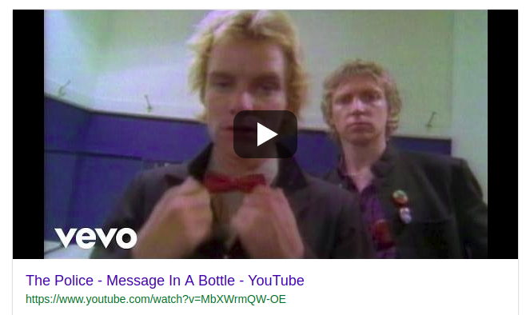

# message-in-a-bottle
A test project using the AWS JavaScript SDK to send SMS messages.




## How to configure and run locally
Install the project dependences:
```
npm install
```

Configure your aws credentials in `~/.aws/credentials:` file:
```
[default]                                                                       
aws_access_key_id=<aws access key>                                          
aws_secret_access_key=<aws secret key>   
```
and `~/.aws/config:` file:
```
[default]                                                                       
region=us-east-1
```

## How to Run
```
npm start
```

## How to Test
```
npm test
```

## How to Contribute
To be defined.